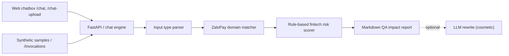

# ZLP ReleaseGuard

ZLP ReleaseGuard is a synthetic internal QA impact agent for ZaloPay-style release reviews. It accepts free-form impact analysis, Git diffs, PRD snippets, release notes, or bug fix summaries — typed, pasted, or uploaded as a file — and returns a QA report covering the full ZaloPay flow scope (not only Payment): missing risks, P0 smoke checks, regression scope, and a Go / Conditional Go / No-Go recommendation.

All sample data in this repository is synthetic. Do not paste production customer data, real secrets, internal endpoints, or confidential ZaloPay artifacts into demos. Secrets (bearer tokens, JWTs, API keys) are redacted automatically before processing, but treat the tool as untrusted for real data.

## Supported Inputs

- Dev impact analysis documents.
- Git diffs or schema/config snippets.
- PRD or acceptance criteria text.
- Release notes and changelogs.
- Bug fix summaries and root cause notes.
- **Uploaded files**: images (auto-OCR), PDF, DOCX, or plain text — extracted and run through the same analyzer as typed text.

Inputs are auto-detected for language (Vietnamese / English) and the report is rendered in the matching language.

Example:

```text
Impact Analysis
Scope: refund only.
Change: retry refund when partner timeout happens.

diff --git a/services/refund_worker.py b/services/refund_worker.py
+ retry_refund(order_id, amount)
```

## Web UI

A chat-style web UI is served at `/` (the static files in `src/zp_release_guard/web/`). It is the primary interface and talks to `POST /chat` and `POST /chat-upload`.

- Multi-turn chat with conversation context and follow-up suggestion chips.
- Quick-start sample buttons (refund / promo / bank linking) and request labels (Impact Analysis, Git diff, PRD, release note, bugfix, security review, P0 checklist).
- File attachments (up to 5 files, ≤10MB each / 20MB total): images are OCR'd, PDF/DOCX/text are parsed; extracted text is shown so you can verify it.
- Bilingual (Vietnamese / English) with auto-detect plus a manual language selector.
- Copy report, download as `.md`, light/dark theme.

### Test cases (cards + Excel export)

When you ask the assistant to write or list test cases (e.g. "viết test case cho refund flow", "list test cases for this section"), the reply is rendered as **structured cards** — grouped by Happy Path / Negative / Edge — each showing precondition, steps, expected result, a PASS/FAIL badge, and notes. A **Download .xlsx** button exports all cases to an Excel sheet (generated client-side via SheetJS). Translate/continue follow-ups (e.g. "tiếng anh", "viết thêm") keep the structured card format. If the model cannot return valid structured data, the reply falls back to plain Markdown.

## Architecture



The critical path is deterministic — the rule engine owns risk detection, scoring, and the Go/No-Go decision. The LLM is used only for **non-decision** work: conversational chat replies, image OCR/transcription, structured test-case generation, and an optional cosmetic report rewrite (`LLM_ENABLE_REWRITE`). All LLM features degrade gracefully: if `LLM_API_KEY` is unset, the deterministic analyzer and report still work, and LLM-only features return a clear "not enabled" message. The LLM rewrite is skipped entirely during tests.

## Local Setup

```bash
python3.11 -m venv .venv
source .venv/bin/activate
pip install -r requirements.txt
pip install -r requirements-dev.txt
pip install -e .
cp .env.example .env   # fill in LLM_* to enable chat / OCR / rewrite (optional)
uvicorn zp_release_guard.api:app --reload --host 127.0.0.1 --port 8000
```

Open the web UI at <http://127.0.0.1:8000/>.

Health check:

```bash
curl http://127.0.0.1:8000/health
```

Analyze:

```bash
curl -X POST http://127.0.0.1:8000/analyze-freeform \
  -H 'Content-Type: application/json' \
  -d '{"message":"Release Notes v2.8.1 cashback campaign for merchant QR payments.","project_hint":"zalopay"}'
```

AgentBase-compatible local run:

```bash
source .venv/bin/activate
python main.py
curl http://127.0.0.1:8080/health
curl -X POST http://127.0.0.1:8080/invocations \
  -H 'Content-Type: application/json' \
  -d '{"message":"Release Notes v2.8.1 cashback campaign for merchant QR payments.","project_hint":"zalopay"}'
```

## Endpoints

| Method | Path | Purpose |
|---|---|---|
| `GET` / `POST` | `/health` | Liveness/readiness probe |
| `POST` | `/analyze-freeform` | One-shot analysis (JSON), returns the QA report |
| `POST` | `/invocations` | AgentBase-compatible business invocation (same as analyze) |
| `POST` | `/chat` | Multi-turn chat; auto-routes to analysis, follow-up, or test-case generation |
| `POST` | `/chat-upload` | Multipart upload (image/PDF/DOCX/text); extracts text and runs the full analyzer |
| `POST` | `/feedback` | Records a 👍/👎 rating for a chat reply |
| `GET` | `/` (and assets) | Static web UI |

`/chat`, `/chat-upload`, `/analyze-freeform`, and `/invocations` are subject to request-size limits, the optional API-key gate, and per-IP rate limiting.

## Environment Variables

Copy `.env.example` to `.env`. All are optional — the deterministic analyzer works without any of them.

| Variable | Purpose |
|---|---|
| `LLM_API_KEY` | Enables all LLM features (chat, OCR, rewrite). Skipped if unset |
| `LLM_BASE_URL` | LLM endpoint (default: VNG MaaS) |
| `LLM_MODEL` | Default model for all roles |
| `LLM_ENABLE_REWRITE` | Enable the optional cosmetic LLM report rewrite (default `false`) |
| `APP_API_KEY` | If set, the LLM-calling endpoints require header `X-API-Key` |
| `RATE_LIMIT_PER_MINUTE` | Per-IP cap on the chat/analyze endpoints (default `120`) |

## Security

- **Secret redaction**: bearer tokens, JWTs, and API keys are stripped before processing and in evidence snippets / at the LLM boundary.
- **Security headers**: responses include a Content-Security-Policy (locked to same-origin plus the CDNs the UI loads) and standard hardening headers.
- **Access control**: optional `X-API-Key` gate plus per-IP rate limiting on the chat/analyze endpoints, and a request-size guard.

## Docker

```bash
docker build -t zp-release-guard .
docker run --rm -p 8080:8080 --env-file .env zp-release-guard
```

For AgentBase deployment, the container listens on port `8080` and exposes `GET /health` for runtime readiness. Business invocation is available at `POST /invocations`; the original `POST /analyze-freeform` route is kept for API demos.

## Synthetic Demo Samples

The built-in samples cover:

- Refund retry with partner timeout and hidden ledger/schema footprint.
- Cashback/voucher campaign with duplicate claim and abuse risk.
- Bank linking/token exchange with old app compatibility and token/session security risk.

## Test

```bash
python -m pytest
```

Coverage focuses on parser detection, domain/risk scoring, report section completeness, secret redaction, FastAPI endpoints, web upload handling, chat engine behavior (including test-case generation and language switching), and security middleware.
